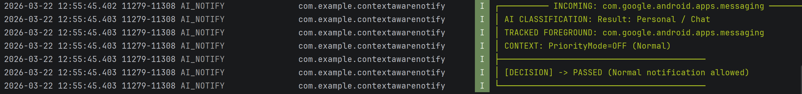
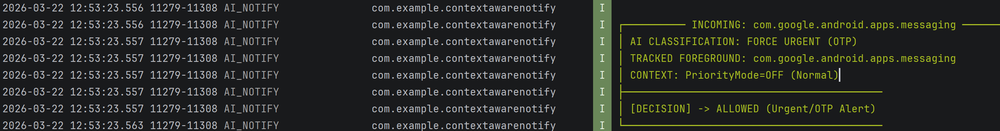
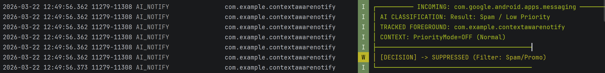
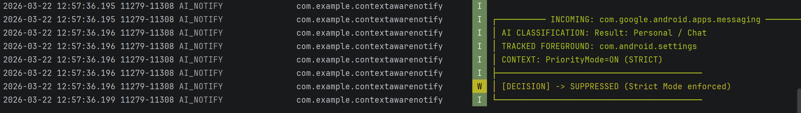

# AI Notification Manager (Android)

[](https://github.com/Sai-developer-6699/AI-notification-manager/actions/workflows/android.yml)


Context-aware notification filtering for Android. This project explores using on-device signals + lightweight ML to reduce notification noise and improve relevance.

## Demo (screenshots)

<p float="left">
  
  
  
  
</p>

More screenshots in [`pictures/`](pictures/).

## Features

- **Context-aware filtering**: routes or suppresses notifications based on inferred user context.
- **Extensible rules**: easy to add new signals, categories, or heuristics.
- **Privacy-minded by default**: keep data local where possible; collect only what you need.
- **Modular design**: core logic separated from UI to simplify iteration.
- **Retrained ML pipeline**: latest training run reached **98% accuracy** with teammate collaboration.

## Tech stack

- **Language**: Kotlin
- **Build**: Gradle (Kotlin DSL)
- **UI**: Android (Jetpack components as used in the project)
- **ML**: DistilBERT training + ONNX conversion pipeline in `model_training/`

## Project structure

- **`app/`**: Android application module
- **`gradle/`**: Gradle wrapper and version catalog/config
- **`pictures/`**: screenshots used by this README
- **`model_training/`**: training, testing, and ONNX export notebooks/scripts

## Model training update

- The model was retrained with support from teammates and reached **98% accuracy** in the latest run.
- Training and export artifacts are now tracked in [`model_training/`](model_training/):
  - `Distilbert_training_and_testing.ipynb`
  - `Onnx_model.ipynb`
  - `onnx_model.py`

## Getting started (development)

### Prerequisites

- Android Studio (latest stable recommended)
- JDK 17 (or the version configured by your Android Gradle Plugin)

### Build and run

```bash
./gradlew assembleDebug
```

Open the project in Android Studio and run the `app` configuration on an emulator or device.

### Tests

```bash
./gradlew test
```

## Configuration

- **`local.properties`** is intentionally ignored (machine-specific paths).
- If your project uses API keys (Firebase, etc.), prefer:
  - `gradle.properties` via environment variables (CI), or
  - `secrets.properties` / `local.properties` style files that are gitignored.

## Architecture notes (high level)

- **Notification ingestion**: receives notifications and extracts minimal metadata needed for classification.
- **Feature extraction**: derives context signals (time, app, device state, etc.).
- **Decision engine**: combines rules/thresholds/ML outputs to decide: allow, mute, batch, or suppress.
- **UI**: surfaces decisions, allows user feedback, and provides controls for tuning.

## Security & privacy

This is a college project. Treat it as a prototype:

- Do not commit secrets (keystores, API keys, tokens).
- Be explicit in your UI about what data is processed and how it is used.
- Prefer on-device processing; avoid uploading notification content.

See [`SECURITY.md`](SECURITY.md).

## Contributing

Contributions are welcome (especially improvements to rules, UX, and test coverage).

See [`CONTRIBUTING.md`](CONTRIBUTING.md).

## License

MIT License. See [`LICENSE`](LICENSE).

